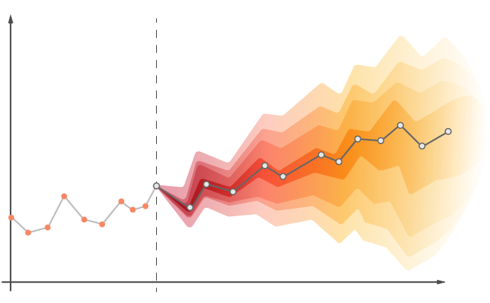

# Time Series Forecasting

## Table of Contents

- [Introduction](#introduction)
- [Key Concepts](#key-concepts)
- [Forecasting Techniques](#forecasting-techniques)

## Introduction

**Time Series Forecasting** is a method used to predict future values based on previously observed data points over time. Time series data is unique in that each data point is dependent on past values, making it essential to account for time dependencies in prediction models.

Time series forecasting is widely used in various domains such as finance, supply chain management, weather forecasting, and healthcare. Typical applications include stock price prediction, energy consumption forecasting, and predicting demand for products or services.

## Key Concepts

1. **Stationarity**: A time series is stationary if its statistical properties (mean, variance) do not change over time. Many forecasting models require the time series to be stationary.
2. **Seasonality**: This refers to repeating patterns or cycles in the data at regular intervals (e.g., daily, weekly, or yearly).
3. **Trend**: A long-term increase or decrease in the data values over time.
4. **Autocorrelation**: The correlation between a time series and a lagged version of itself.
5. **Moving Averages**: A technique used to smooth out short-term fluctuations and highlight longer-term trends.

## Forecasting Techniques

1. **Statistical Models**:
   - **ARIMA (AutoRegressive Integrated Moving Average)**: One of the most popular models for time series forecasting, ARIMA models account for autocorrelation in the data.
   - **SARIMA (Seasonal ARIMA)**: An extension of ARIMA that also models seasonality.
   - **Exponential Smoothing (ETS)**: This model accounts for trend and seasonality in time series data using weighted averages.

2. **Machine Learning Models**:
   - **Random Forest**: Although typically used for regression and classification, Random Forest can also be adapted for time series forecasting.
   - **XGBoost**: A gradient boosting technique that can handle temporal data when proper feature engineering is applied.

3. **Deep Learning Models**:
   - **Recurrent Neural Networks (RNNs)**: Specifically designed for sequential data, RNNs are capable of capturing time dependencies.
   - **Long Short-Term Memory Networks (LSTMs)**: A type of RNN that is particularly effective in learning long-term dependencies in time series data.
   - **GRU (Gated Recurrent Unit)**: Similar to LSTMs but with a simpler architecture, making them computationally efficient.
   - **Transformer Models**: Recently, transformer models have gained popularity for time series forecasting due to their ability to handle long-range dependencies.

